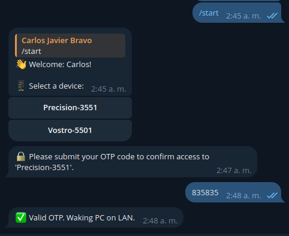

# Wake On LAN Remotely

---

## Turn on your PC remotely, without interruptions!

Tired of bothering someone at home to turn on your computer when you need remote access? This project stems from a common need: to power on your workstation from anywhere, without relying on anyone else.

Like many, I work with two computers: a powerful workstation at home and a lighter laptop. Frustration arose when I needed something from my main PC while away and had to ask someone to turn it on.

### Why this solution?

I tried several alternatives before arriving at this one:

- **Smart Plugs (like TP-Link Tapo):** Although the app often failed outside the local network, I managed to access and control the device thanks to someone who dedicated themselves to [reverse-engineering](https://github.com/softScheck/tplink-smartplug/tree/master) these devices. However, unexpected power-ons due to power outages (frequent in Latin America) made it unfeasible.
- **Microcontroller-based devices (e.g., Raspberry Pi Pico):** Simulating the power button was an option, but I found it cumbersome and less practical.
- **Python scripts with LibreComputer Board Le Potato:** This was the most promising option, sending "Magic Packets" to turn on the PC. However, I felt I could make it much more user-friendly and accessible.

The final motivation came from my brother also suffering from the same problem. The difference is that I know a bit about code and electronics, and I wanted a solution anyone could use.

---

## Required Hardware:

This project has been successfully tested on a **Raspberry Pi Zero 1.3W** (1 CPU, 512 MB RAM), which was sufficient to run the proposed code. However, in my personal case, I run it on a **Raspberry Pi 4B**, which I also use as a RustDesk server and for other services.

## Required Software:

Python 3.9 or higher.

**Your target computer must be configured for Wake On LAN (WoL):** Ensure that your BIOS/UEFI and operating system allow and have this function enabled. The configuration varies by manufacturer and operating system.

---

## How it Works:

This project is based on a **simple Telegram bot** that allows you to control powering on your devices.

The following parameters must be defined in an `.env` file:

1. **Initial Configuration:** You must define the following parameters in an `.env` file:

   ```bash
   TELEGRAM_TOKEN=1234567890:AnyTeleBotToken
   HAS_OTP_VALIDATION=false  # Optional
   ISSUER_HANDLER=AlienNerdDev  # Optional
   ```

2. **Install Requirements:** It's recommended to create a virtual environment for this project.

   Bash

   ```bash
   python3 -m venv .venv
   source .venv/bin/activate
   ```

   Bash

   ```bash
   pip install -r requirements.txt
   ```

   Once the requirements are ready, simply run:

   Bash

   ```bash
   python main.py
   ```

3. **Start Conversation:** Upon starting a conversation with the bot (`/start`), it will show you a list of devices associated with your Telegram ID.

   

4. **OTP Validation (Optional):**

   - If `HAS_OTP_VALIDATION` is set to `true` or `1` in the `.env` file, the bot will send you an `otp_secret` for the first time, and if available, an image with a QR code to scan with your preferred authentication app (e.g., Authy).

     

     > [!IMPORTANT]

     > These messages will be automatically deleted in one minute for security.

   - When `HAS_OTP_VALIDATION` is `true`, every time you try to turn on a computer, the bot will ask for an OTP as additional validation.

     

   - If `HAS_OTP_VALIDATION` is `false` or not defined, the bot will execute the Wake On LAN command directly when you select your computer, without OTP validation.

---

## Remote Desktop Connectivity

Once your PC is powered on, you'll need a way to connect to it remotely. Personally, I've explored several options:

- **TeamViewer or AnyDesk:** In the past, I used them, but their usage limitations and non-open-source nature led me to seek alternatives. Also, TeamViewer wasn't always friendly with Ubuntu 20.04 (my main OS for work; ironically, I only use Windows for gaming).
- **RustDesk:** My current and recommended option! It's open-source and allows you to create your own local server. In fact, I was able to set up my RustDesk server on my Raspberry Pi 4.
- **Tailscale:** For managing connectivity outside my local network, I use Tailscale. However, your choice of VPN or remote connectivity method is up to you.

---

## How to Add New Users and Devices?

I've included an example script called `generate_user.py`. Within this file, you'll find the structure and method for adding new users, devices, and their respective MAC addresses.

---

## How to Start this Script at Raspbian Startup?

Instead of a cron job, it's much better to run this script as a **service** in Raspbian, which provides more robustness and control.

First, create a `main.sh` file that will activate the virtual environment and execute your Python script:

Bash

```bash
touch /path/to/WakeOnLan/main.sh
```

Inside `main.sh`, enter the following content. Make sure to replace `/path/to/WakeOnLan/` with the actual path to your project:

Bash

```bash
#!/bin/bash
cd /path/to/WakeOnLan/
source /path/to/WakeOnLan/.venv/bin/activate
python main.py
```

Now, create a service file named `WakeOnLan.service`:

Bash

```bash
touch /path/to/WakeOnLan/WakeOnLan.service
```

The content of `WakeOnLan.service` should be as follows. Again, replace `/path/to/WakeOnLan/` with the correct path:

Bash

```bash
[Unit]
Description=Wake On Lan Service
DefaultDependencies=no
After=local-fs.target
Requires=local-fs.target

[Service]
Type=simple
Restart=always
RestartSec=10
ExecStart=/bin/bash /path/to/WakeOnLan/main.sh

[Install]
WantedBy=multi-user.target
```

Once you've created `WakeOnLan.service`, copy it to `/etc/systemd/system/`. Then, reload `systemd`, enable the service to start automatically, and start it:

Bash

```bash
sudo cp /path/to/WakeOnLan/WakeOnLan.service /etc/systemd/system

sudo systemctl daemon-reload
sudo systemctl enable WakeOnLan.service
sudo systemctl start WakeOnLan.service
```

With these steps, your Wake On LAN bot will automatically start every time your Raspberry Pi boots up.