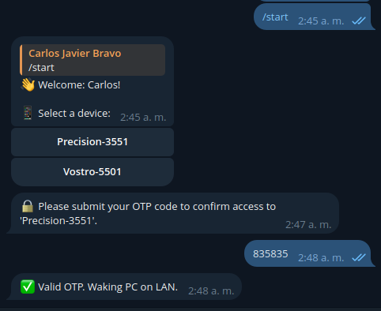

# Wake On Lan Remotely

---


## ¡Enciende tu PC a distancia, sin interrupciones!

¿Cansado de molestar a alguien en casa para que encienda tu computadora cuando necesitas acceder a ella remotamente? Este proyecto nace de una necesidad común: encender tu estación de trabajo desde cualquier lugar, sin depender de nadie más.

Yo, como muchos, trabajo con dos equipos: una potente estación de trabajo en casa y un equipo portátil más ligero. La frustración surgía cuando necesitaba algo de mi PC principal estando fuera, y tenía que pedirle a alguien que la encendiera.

### ¿Por qué esta solución?
Probé varias alternativas antes de llegar a esta:

* Smart Plugs (como TP-Link Tapo): Aunque la aplicación a menudo fallaba fuera de la red local, logré acceder y manipular el dispositivo gracias a una persona quien se dedicó a hacerle [ingeniería a la inversa](https://github.com/softScheck/tplink-smartplug/tree/master) de estos dispositivos. Sin embargo, los encendidos inesperados por cortes de energía (frecuentes en Latinoamérica) lo hicieron inviable.
* Dispositivos basados en Microcontroladores, por ejemplo Raspberry Pi Pico: Simular el botón de encendido era una opción, pero la encontré engorrosa y menos práctica.
* Scripts de Python con LibreComputer Board Le Potato: Esta fue la opción más prometedora, enviando "Magic Packets" para encender la PC. Sin embargo, sentí que podía hacerla mucho más amigable y accesible.

La motivación final parte de que también mi hermano padecía del mismo problema, la diferencia es que yo si conozco algo de código y electrónica, y queria una solucion que cualquiera pudiera usar.

---

## Hardware Requerido:

Este proyecto ha sido probado con éxito en una **Raspberry Pi Zero 1.3W** (1 CPU, 512 MB RAM), y fue suficiente para ejecutar el código propuesto.  Sin embargo, en mi caso personal, lo ejecuto en una **Raspberry Pi 4B**, que también utilizo como servidor RustDesk y para otros servicios.

## Software Requerido

Python 3.9 o superior. 

**Tu equipo destino debe estar configurado para Wake On LAN (WoL):** Asegúrate de que tu BIOS/UEFI y tu sistema operativo permitan y tengan habilitada esta función. La configuración varía según el fabricante y el sistema operativo.

---

## Como funciona:

Este proyecto se basa en un **sencillo bot de Telegram** que te permite controlar el encendido de tus equipos.

Se debe definir en un archivo `.env` los siguientes parametros

1. **Configuración inicial:** Debes definir los siguientes parámetros en un archivo `.env`:

    ```bash
    TELEGRAM_TOKEN=1234567890:AnyTeleBotToken
    HAS_OTP_VALIDATION=false  # Optional
    ISSUER_HANDLER=AlienNerdDev  # Optional 
    ```

2. Instalar los requerimientos: Se recomienda crear un Entorno Virtual para este proyecto

    ```bash
    python3 -m venv .venv
    source .venv/bin/activate
    ```

    ```bash
    pip install -r requirements.txt
    ```

    Una vez teniendo los requerimientos listos, solo se debe ejecutar
    ```bash
    python main.py
    ```

3. **Inicio de la conversación:** Al iniciar la conversación con el bot (`/start`), este te mostrará una lista de los dispositivos asociados a tu ID de Telegram.

    

4. **Validación OTP (Opcional):**

   - Si `HAS_OTP_VALIDATION` está configurado como `true` o `1` en el `.env`, el bot te enviará por primera vez un `otp_secret` y, si está disponible, una imagen con un código QR para escanear con tu aplicación de autenticación preferida (por ejemplo, Authy).

     

     > [!IMPORTANT]
     >
     > Estos mensajes se eliminarán automáticamente en un minuto por seguridad.

   - Cuando `HAS_OTP_VALIDATION` es `true`, cada vez que intentes encender una computadora, el bot te pedirá un OTP como validación adicional.

     

   - Si `HAS_OTP_VALIDATION` es `false` o no está definido, el bot ejecutará el comando Wake On LAN directamente al seleccionar tu computadora, sin la validación OTP.

---

## Conectividad por Escritorio Remoto

Una vez que tu PC esté encendida, necesitarás una forma de conectarte a ella remotamente. Personalmente, he explorado varias opciones:

- **TeamViewer o AnyDesk:** En el pasado, los usé, pero sus limitaciones de uso y su naturaleza no *OpenSource* me llevaron a buscar alternativas. Además, TeamViewer no siempre era amigable con Ubuntu 20.04 (mi SO principal para trabajar, irónicamente solo uso Windows para jugar).
- **RustDesk:** ¡Mi opción actual y recomendada! Es *OpenSource* y te permite crear tu propio servidor local. De hecho, pude configurar mi servidor RustDesk en mi Raspberry Pi 4.
- **Tailscale:** Para gestionar la conectividad fuera de mi red local, utilizo Tailscale. Sin embargo, la elección de tu VPN o método de conectividad remota queda a tu criterio.

---

## ¿Cómo añadir nuevos usuarios y dispositivos?

He incluido un script de ejemplo llamado `generate_user.py`. Dentro de este archivo, encontrarás la estructura y el método para agregar nuevos usuarios, dispositivos y sus respectivas direcciones MAC.

---

## ¿Cómo arrancar este script al iniciar Raspbian?

En lugar de un cronjob, es mucho mejor ejecutar este script como un **servicio** en Raspbian, lo que le da más robustez y control.

Primero, crea un archivo `main.sh` que se encargará de activar el entorno virtual y ejecutar tu script de Python:

```bash
touch /path/to/WakeOnLan/main.sh
```

Dentro de `main.sh`, ingresa el siguiente contenido. Asegúrate de reemplazar `/path/to/WakeOnLan/` con la ruta real de tu proyecto:

```bash
#!/bin/bash
cd /path/to/WakeOnLan/
source /path/to/WakeOnLan/.venv/bin/activate
python main.py
```

Ahora, crea un archivo de servicio llamado `WakeOnLan.service`

```
touch /path/to/WakeOnLan/WakeOnLan.service
```

El contenido de `WakeOnLan.service` debe ser el siguiente. Nuevamente, reemplaza `/path/to/WakeOnLan/` con la ruta correcta

```bash
[Unit]
Description=Wake On Lan Service
DefaultDependencies=no
After=local-fs.target
Requires=local-fs.target

[Service]
Type=simple
Restart=always
RestartSec=10
ExecStart=/bin/bash /path/to/WakeOnLan/main.sh

[Install]
WantedBy=multi-user.target
```

Una vez que hayas creado `WakeOnLan.service`, cópialo a `/etc/systemd/system/`. Luego, recarga `systemd`, habilita el servicio para que se inicie automáticamente y arráncalo

```bash
sudo cp /path/to/WakeOnLan/WakeOnLan.service /etc/systemd/system

sudo systemctl daemon-reload
sudo systemctl enable WakeOnLan.service
sudo systemctl start WakeOnLan.service
```

Con estos pasos, tu bot de Wake On LAN se iniciará automáticamente cada vez que tu Raspberry Pi arranque
